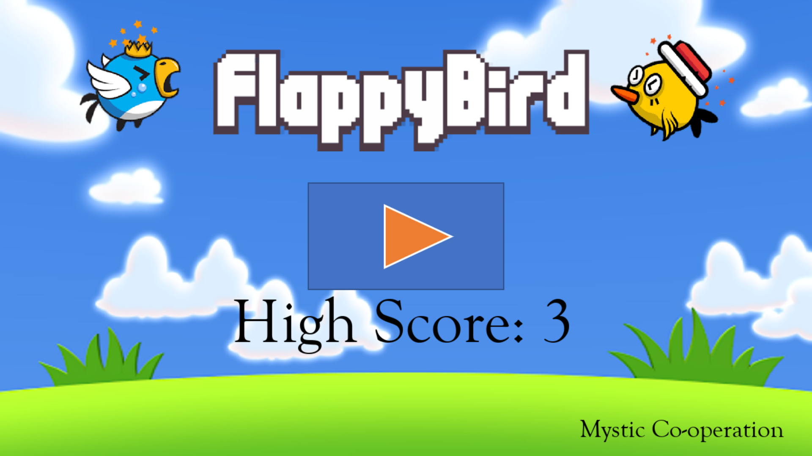

## FlappyBird
Well known **Flappy Bird** :bird: game coded in Python using pygame. 
:thinking:Thinking of upgrading it with other features and coding it in Tkinter - *a Python binding to the Tk GUI toolkit.*  
📸Some shots from the game include:
 
 
